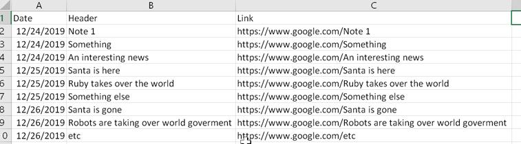

# News table.

## Instructions

Proceed to the creation of a small desktop application, no login needed, that every 5 minutes or on-demand, using an API Call to your favorite news feed, picks up the latest headlines, and write the header in an excel-like screen.

We should be able to see the history up to 3 days ago. A small search is optional.

Expected output should be something like the below.

## Notes
* The search button serves also as a refresh, using the last search query as a parameter. (Not the best UX by a long shot, but it works).

